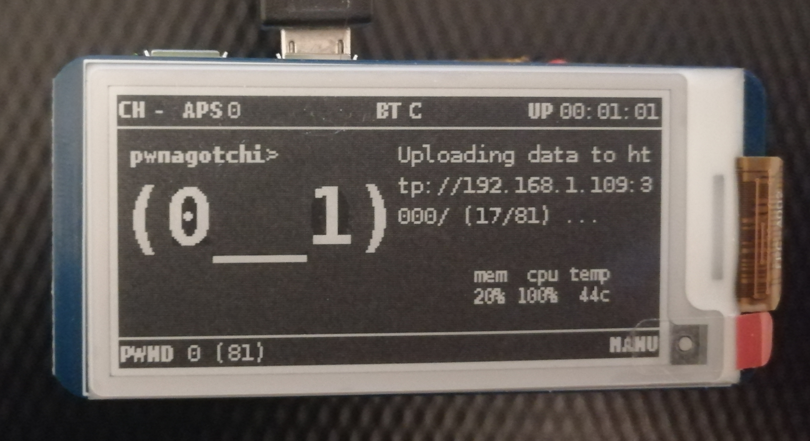

# WPA Cracking Project with Pwnagotchi

## Description

This project is developed as part of a university thesis, focusing on creating a Pwnagotchi plugin that uploads WPA handshake captures. Additionally, a web application is implemented to process these handshakes using Hashcat. 

## Pwnagotchi Plugin Installation and Configuration

### Installation

First, you need to install the Pwnagotchi plugin. Download or place the plugin into the Pwnagotchi system, then follow the plugin installation instructions provided in the Pwnagotchi documentation or use the following command (replace `plugin-name` with the actual name of the plugin):

```sh
sudo pwnagotchi plugins install plugin-name
```

### Configuration

After installing the plugin, add the following configuration to your `config.toml`:

```toml
main.plugins.pwnagotchi-plugin.enabled = true
main.plugins.pwnagotchi-plugin.api_key = ""
main.plugins.pwnagotchi-plugin.api_url = ""
main.plugins.pwnagotchi-plugin.download_results = false
main.plugins.pwnagotchi-plugin.whitelist = []
```

You will receive the `api_key` when you register on the web application. This key is necessary for the plugin to authenticate and communicate with the backend.



## Backend

The backend is built using a Node.js application.

### Tools needed

- Hashcat

- hcxpcapngtool

### Databases

- MongoDB

- Redis

### .env example

Create a `.env` file with the following environment variables:

```
PORT=3000
WORDLIST_PATH='wordlist.txt'
MONGO_URI='mongodb://yourmongohost:27017/yourdatabase'
REDIS_HOST='yourredishost'
REDIS_PORT=6379
JWT_SECRET='yoursecret'
```

## Frontend
